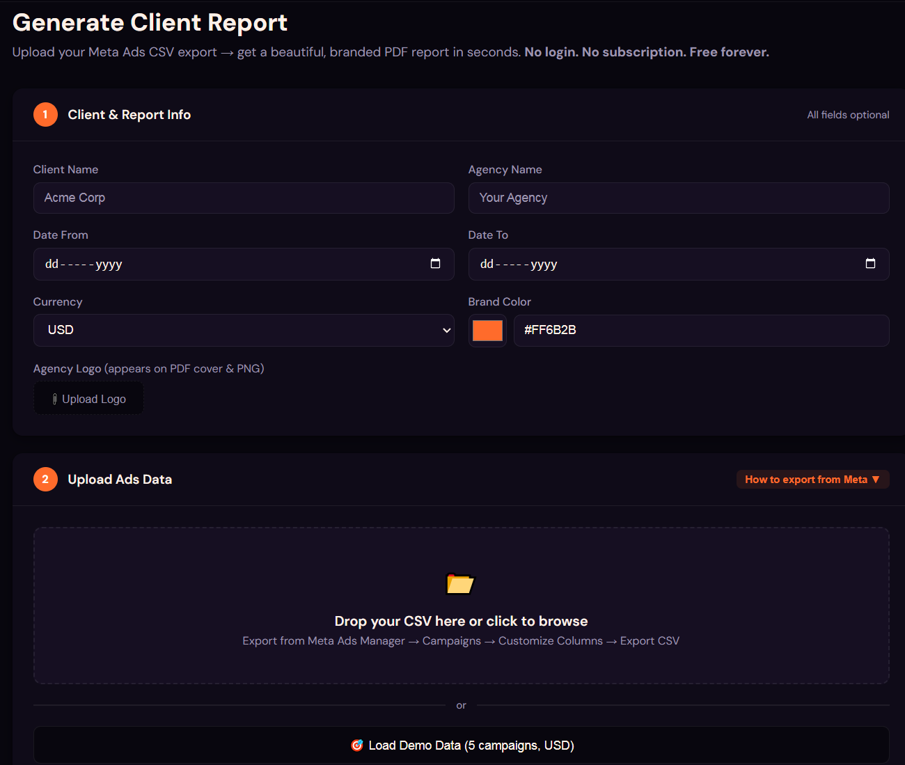
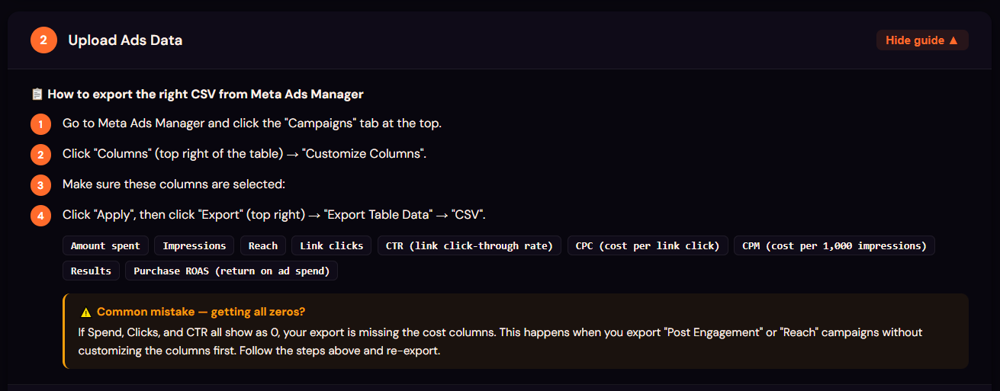
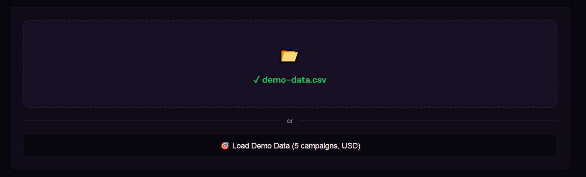
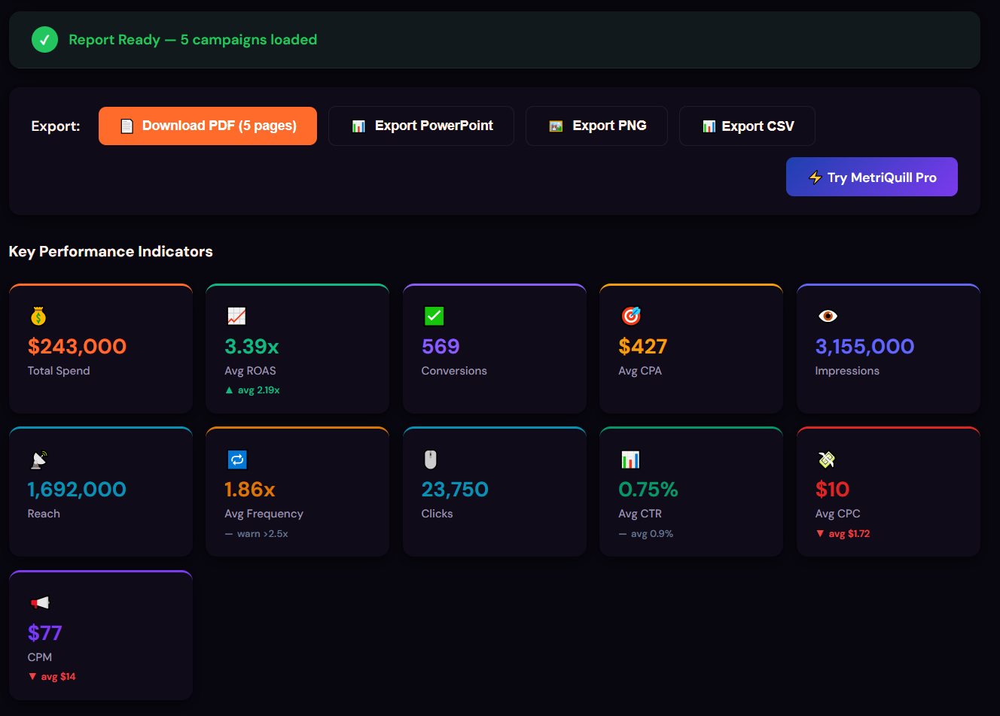
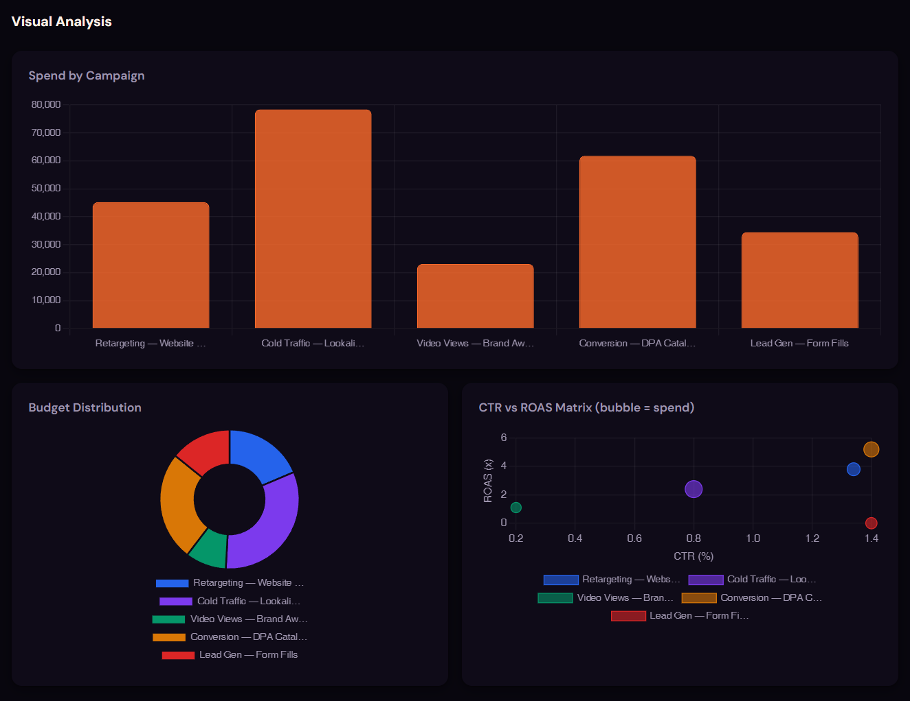
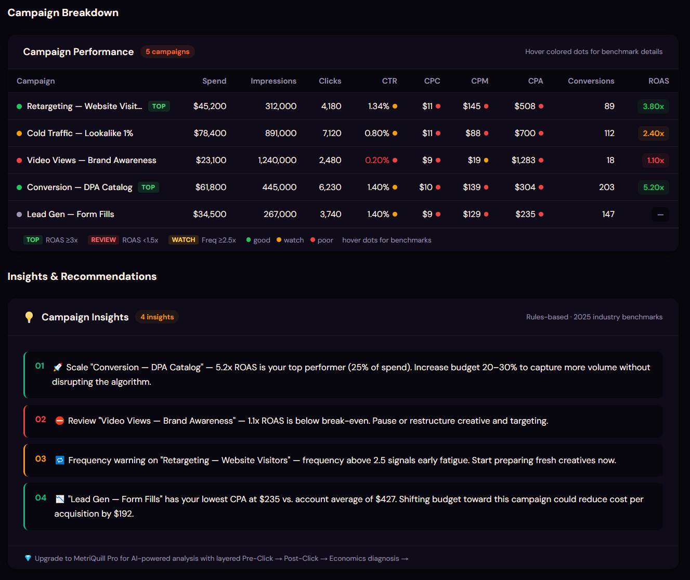
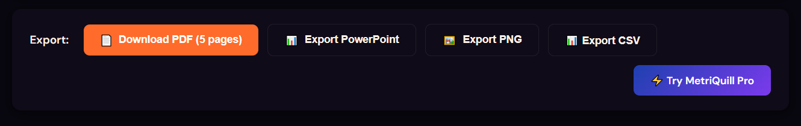

<div align="center">
  
  <h1>MetriQuill Free</h1>
  <p><strong>Meta Ads CSV → Branded PDF Report in 30 seconds. No login. No subscription. Free forever.</strong></p>

  <a href="https://metriquill.com/free"></a>
  <a href="https://github.com/hidude187/metriquill-free/stargazers"></a>
  
  
</div>

---

## What It Does

Upload your **Facebook / Meta Ads Manager CSV export** and instantly generate:

| Output | Description |
|---|---|
| 📄 **PDF Report (5 pages)** | Cover + executive summary + campaign breakdown + insights + recommendations |
| 🖼️ **Social PNG (1200×675)** | Share-ready card for WhatsApp / Slack / LinkedIn |
| 📊 **PowerPoint Deck** | Editable slides for client presentations |
| 📥 **Clean CSV** | Normalized data with CPA column added |

**Your data never leaves your browser. No backend. No cookies. No tracking.**

---

## Screenshots

### Tool Interface — Fill in client info, upload CSV, pick your brand color



### Report Dashboard — KPI cards at a glance



### Campaign Performance Breakdown



### Charts — Spend distribution and ROAS comparison



### AI-Style Insights Panel



### Export Options — PDF, PNG, PPTX, CSV



### Generated PDF Report



---

## Features

### Report Intelligence
- **CPA calculated automatically** from spend ÷ conversions
- **Campaign health badges** — TOP / REVIEW / WATCH based on ROAS + frequency
- **Benchmark comparisons** — your CTR, ROAS, CPC, CPM vs 2025 industry averages (▲ / ▼)
- **Ad fatigue detection** — frequency warning at 2.5×, danger flag at 4.0×
- **Campaign type awareness** — awareness campaigns aren't judged by ROAS
- **CTR vs Conversion diagnostic** — flags high-CTR / zero-conversion as a landing page problem
- **Rules-based insights** — scale winners, pause losers, budget concentration alerts

### PDF Structure (5 pages)
1. Branded cover — logo, agency name, date range, KPI summary boxes
2. Executive summary — narrative paragraph + KPI vs benchmark table
3. Campaign breakdown — spend, impressions, CTR, CPC, CPA, conversions, ROAS
4. Campaign insights — color-coded by performance tier
5. Actionable recommendations for next period

### Customization
- **Logo upload** — your logo appears on PDF cover and PNG export
- **Brand color picker** — applied throughout the entire report
- **Arabic RTL support** — Amiri font embedded in PDF
- **Demo data** — test the full flow without a real CSV

---

## Supported Currencies

**USD · EUR · GBP · DZD · SAR · AED · MAD · TND · EGP · TRY**

The only free reporting tool with proper MENA currency support.

---

## How to Use

1. Go to **[metriquill.com/free](https://metriquill.com/free)**
2. Enter client name, agency name, date range, currency, brand color
3. Upload your Meta Ads CSV (from Ads Manager → Reports → Export Table Data)
4. Click **Generate Report**
5. Download PDF / PNG / PPTX / CSV

That's it. 30 seconds.

---

## How to Export a Meta Ads CSV

1. Open **Meta Ads Manager**
2. Select your campaigns
3. Click **Reports** → **Export Table Data**
4. Choose **CSV** format
5. Upload the downloaded file to MetriQuill

The tool handles Facebook's inconsistent column naming automatically (`Amount Spent`, `Spend`, `amount_spent` all map correctly).

---

## Running Locally

```bash
git clone https://github.com/hidude187/metriquill-free
cd metriquill-free
npm install
npm run dev
```

Open [http://localhost:3000/free](http://localhost:3000/free)

---

## Tech Stack

| Layer | Library |
|---|---|
| Framework | Next.js 15 (App Router) |
| Charts | Chart.js |
| PDF | jsPDF |
| CSV Parsing | PapaParse |
| PowerPoint | PptxGenJS |
| Styling | Tailwind CSS |

No backend. No database. No cookies. 100% client-side.

---

## Why This Exists

Every paid reporting tool (Whatagraph $199/mo, AgencyAnalytics $12/client/mo, DashThis $49/mo) requires OAuth setup, monthly subscriptions, and accounts. There was no free, no-login, open-source option for the "I exported a CSV and need a PDF in 60 seconds" workflow — especially for freelancers and agencies in MENA markets.

MetriQuill Free fixes that.

---

## Roadmap

- [ ] TikTok Ads CSV support
- [ ] Google Ads CSV support
- [ ] Period comparison (vs previous month)
- [ ] Arabic UI (RTL layout toggle)
- [ ] French UI
- [ ] More regional benchmarks

---

## License

MIT — free to use, fork, and modify.

---

<div align="center">
  Made with ☕ by <a href="https://metriquill.com">MetriQuill</a><br/>
  Need AI-powered analysis, client management, and scheduled reports? <a href="https://metriquill.com"><strong>Try MetriQuill Pro →</strong></a>
</div>
