<div align="center">
  
  <h1>MetriQuill Free</h1>
  <p>
    <strong>Turn a Meta Ads CSV into a branded client report in 30 seconds.</strong><br />
    Free. No login. Your data stays in your browser.
  </p>

  <a href="https://free.metriquill.com"></a>
  <a href="./LICENSE"></a>
  <a href="https://github.com/hidude187/metriquill-free/actions/workflows/ci.yml"></a>
  <a href="https://github.com/hidude187/metriquill-free/stargazers"></a>

  <br /><br />
  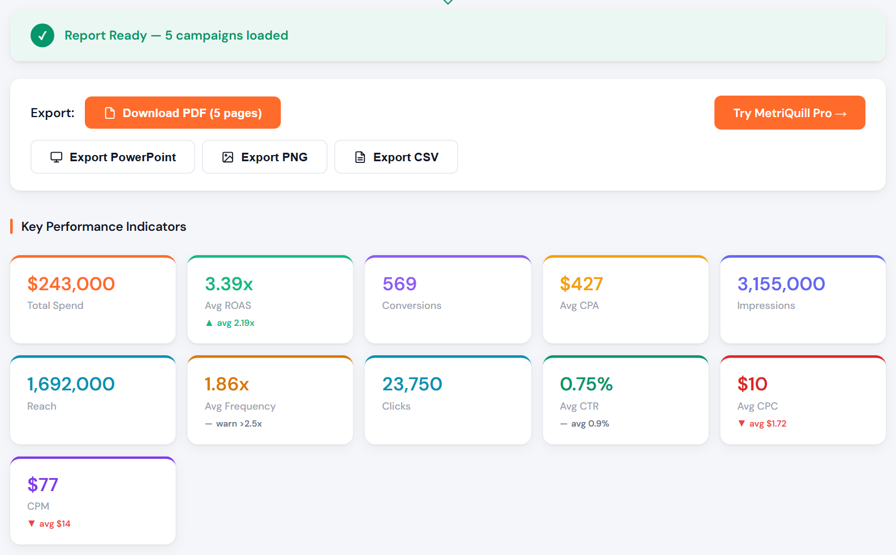
</div>

## What it does

MetriQuill Free is a Meta Ads (Facebook and Instagram Ads) report generator. Export your campaigns from Meta Ads Manager as a CSV, add your client and brand details, and get a client-ready report: no account, no ad-account connection, no subscription.

| Output | What you get |
| --- | --- |
| **PDF report** | 5 pages: branded cover, executive summary with benchmarks, campaign breakdown, insights, recommendations |
| **PowerPoint deck** | 6 editable slides for client presentations |
| **PNG share card** | 1200x675 image for WhatsApp, Slack or LinkedIn |
| **Clean CSV** | UTF-8 with BOM, opens correctly in Excel |

Everything runs in your browser. There is no backend, no database and no login.

## See it in action

**1. Add client details:** client and agency name, dates, currency, brand color and your logo.

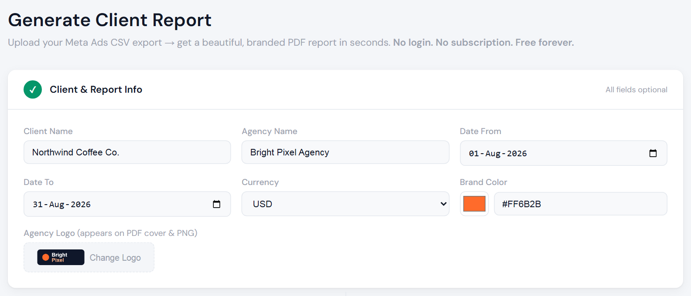

**2. Upload your CSV** (or load the demo data to try the full flow).

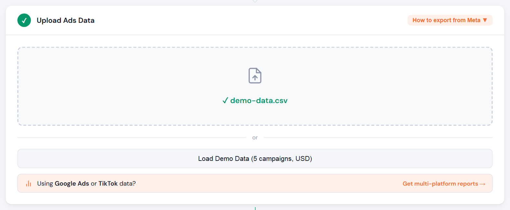

**3. Read the charts:** spend, results and efficiency by campaign.

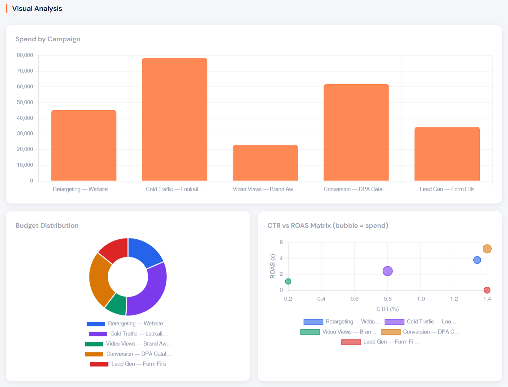

**4. Spot winners and problems:** every campaign gets a health badge (TOP, REVIEW or WATCH).

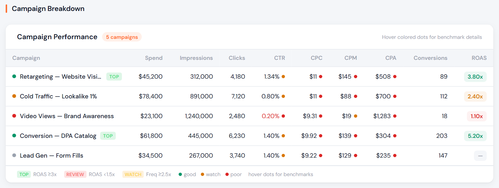

**5. Get insights and next steps** written in plain language.

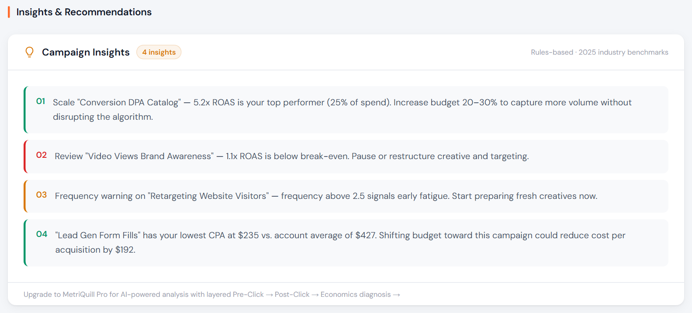

### The exported PDF

<p align="center">
  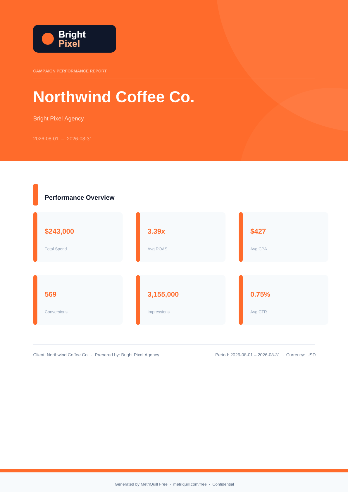
  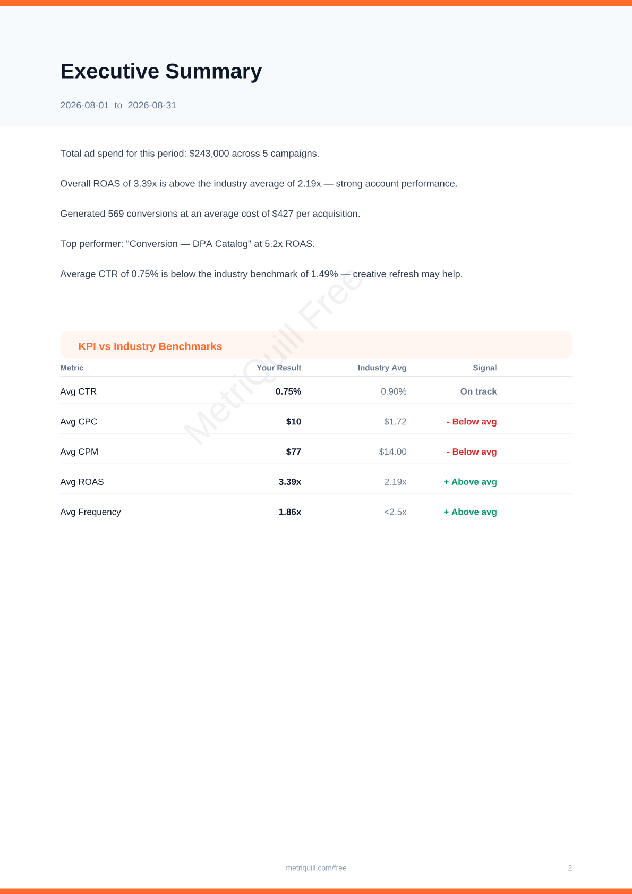
  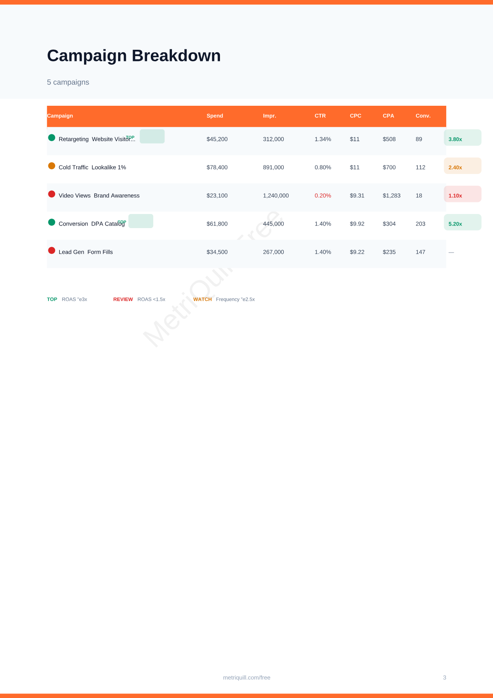
</p>
<p align="center">
  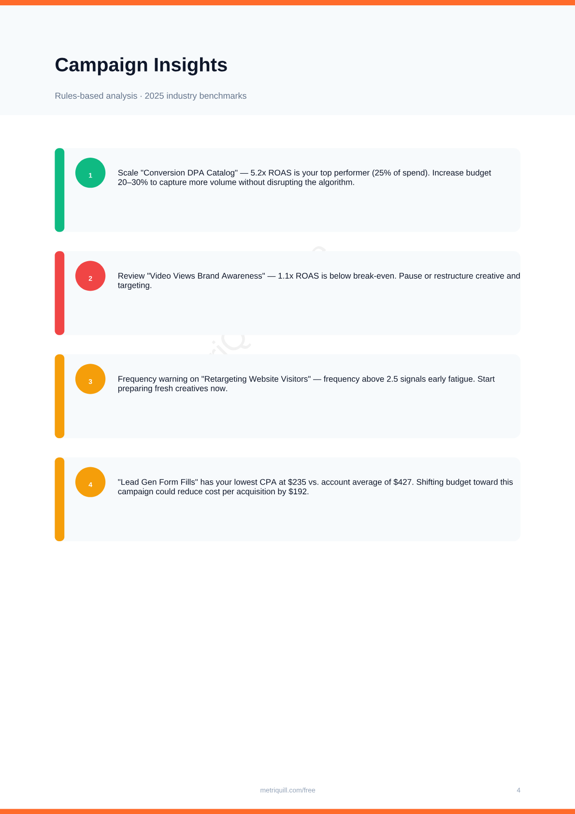
  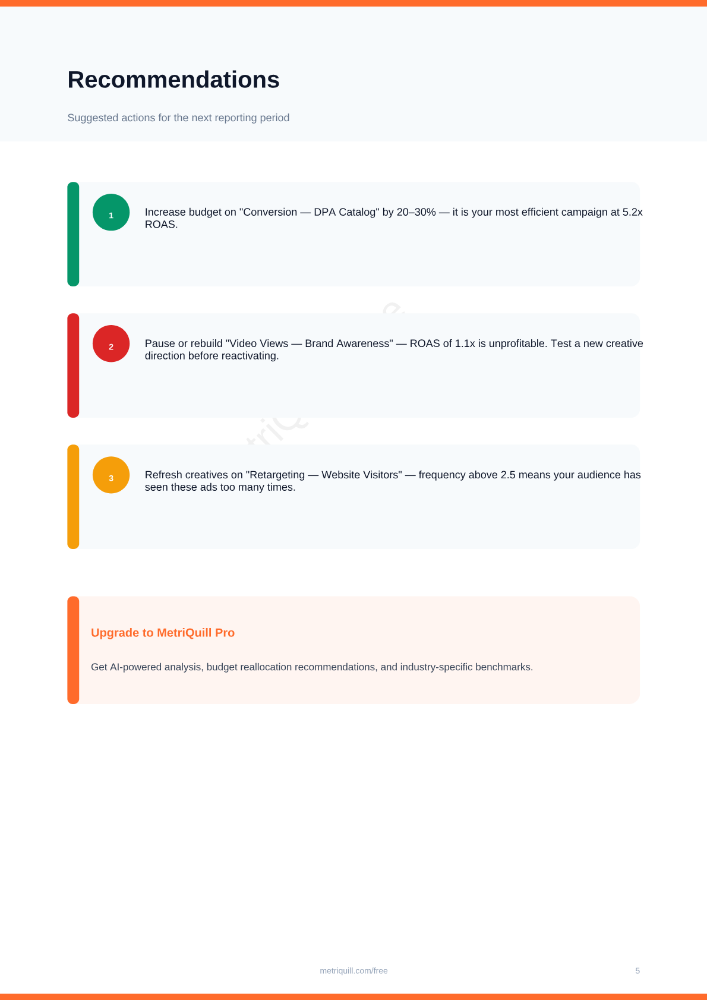
</p>

### The PNG share card

<p align="center">
  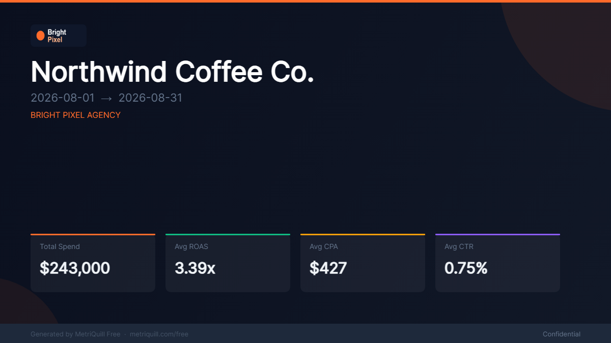
</p>

## Features

**Reporting intelligence**

- 11 KPI cards, each compared against 2025-2026 cross-industry benchmarks with health indicators and tooltips.
- CPA is calculated for you (Meta does not export it).
- Campaign health badges (TOP, REVIEW, WATCH) based on ROAS, CTR, spend and frequency.
- Ad fatigue detection: frequency warning at 2.5 and danger flag at 4.0.
- Awareness campaigns are not judged by ROAS.
- Diagnostics such as "strong CTR but zero conversions" (a landing page or offer problem).
- Rules-based insights and recommendations you can read and change in [`lib/insights.ts`](lib/insights.ts). No AI, no guesswork.

**Made for agencies**

- Your logo (up to 2 MB) and brand color on the PDF cover and the PNG card.
- 10 currencies: USD, EUR, GBP, TRY and MENA currencies (AED, SAR, MAD, DZD, TND, EGP).
- Recognizes common Meta column-name variants (see `KEY_MAP` in [`lib/csvParser.ts`](lib/csvParser.ts)).
- A demo data button so you can try everything without a CSV.

## Privacy

Your CSV is parsed in your browser and never uploaded. The code contains no backend calls, analytics, cookies or local storage. The only third-party request is a web font (Amiri, used for Arabic client names on the PNG card), loaded from Google Fonts when you export.

## Limits and known gaps

- CSV files up to 20 MB; the first 2,000 rows are used.
- Built for standard Meta Ads Manager exports.
- Arabic: client names render on the PNG card. In the PDF, campaign names that contain Arabic are replaced with "Campaign 1, 2, ..." for now.
- Benchmarks are generic cross-industry values, not per vertical.
- Insights are rules, not AI.

## Export the right CSV from Meta Ads Manager

1. Open Meta Ads Manager and go to the **Campaigns** tab.
2. Click **Columns**, then **Customize Columns**, and select: Amount spent, Impressions, Reach, Link clicks, CTR (link click-through rate), CPC (cost per link click), CPM (cost per 1,000 impressions), Results, Purchase ROAS (return on ad spend).
3. Click **Apply**, then **Export**, then **Export Table Data**, then **CSV**.
4. Upload the file at [free.metriquill.com](https://free.metriquill.com).

If Spend, Clicks and CTR all show as 0, the export is missing the cost columns. Re-export with the columns above.

## Run it locally

Requires Node.js 20.9 or newer. No environment variables or API keys are needed.

```bash
git clone https://github.com/hidude187/metriquill-free.git
cd metriquill-free
npm install
npm run dev
```

Open http://localhost:3000. More in [`docs/onboarding.md`](docs/onboarding.md), and the module map in [`docs/architecture.md`](docs/architecture.md).

## Tech stack

| Layer | Library |
| --- | --- |
| Framework | Next.js 16 (App Router), React 19, TypeScript |
| Charts | Chart.js with react-chartjs-2 |
| PDF | jsPDF |
| PowerPoint | PptxGenJS |
| CSV parsing | PapaParse |
| Styling | Inline CSS with CSS variables (design tokens) |

## Roadmap

- [ ] TikTok Ads CSV support
- [ ] Google Ads CSV support
- [ ] Period comparison (this month vs last month)
- [ ] Arabic and French interface, and full Arabic support in the PDF
- [ ] More regional and per-vertical benchmarks

## Contributing

Bug reports, CSV edge cases and pull requests are welcome. Start with [CONTRIBUTING.md](CONTRIBUTING.md). Issues labeled `good first issue` are the easiest way in. Please never attach real client data: paste only the CSV header row.

## License

MIT + Commons Clause (source-available). Free to use, fork and modify for personal or internal use. You may not sell the software, or a product or service whose value comes substantially from it. Full terms in [LICENSE](LICENSE).

## About

Made by [MetriQuill](https://metriquill.com?utm_source=github&utm_medium=readme&utm_campaign=free-repo). Need saved reports, client management, scheduled exports and multi-platform analysis? See [MetriQuill Pro](https://metriquill.com?utm_source=github&utm_medium=readme&utm_campaign=free-repo).
